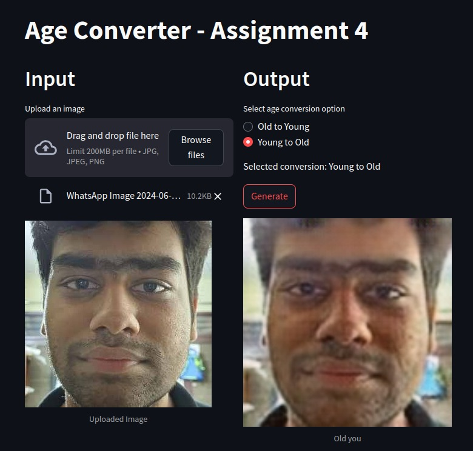
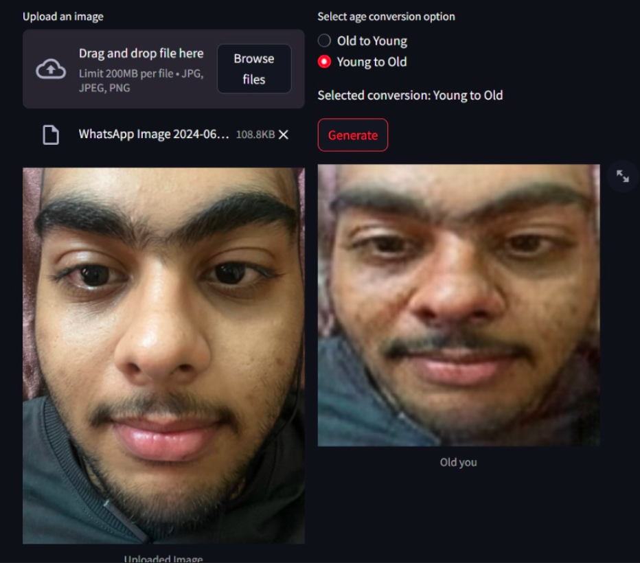
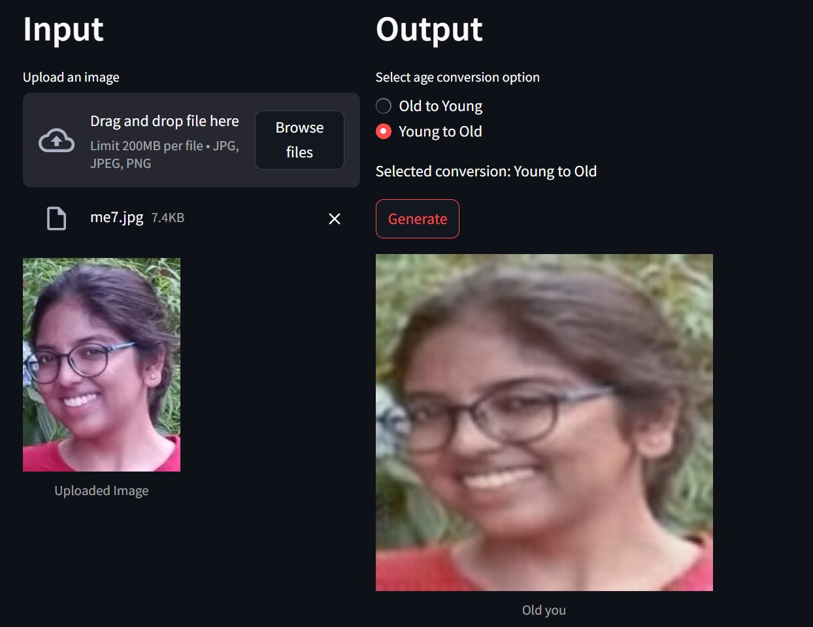
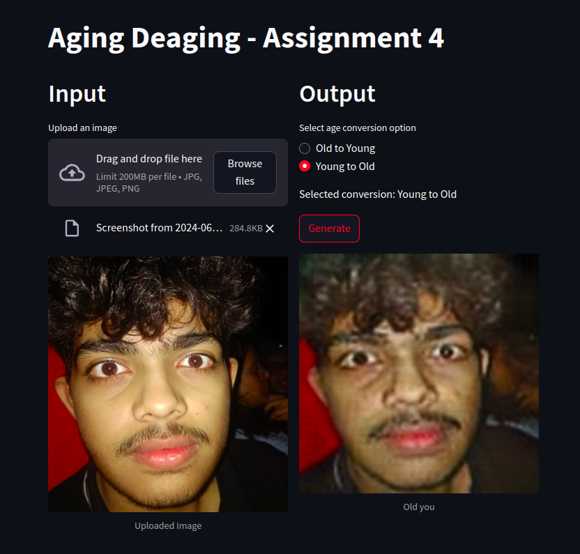

Illusion-Craft

## Stack GAN

Members:

1)Ikrima 

2)Arush 

3)Durbasmriti

## Important Links:
## [Generator](https://drive.google.com/file/d/1sYIqIEoqmyIEljTwJYM6vRqJjhNLwbUi/view?usp=sharing)

## [Discriminator](https://drive.google.com/file/d/1AeAzluqEEoivc5FsQML2J-PfnBSNC7cI/view?usp=sharing)
## Datasets used :

[7,000 Labeled Pokémon Dataset](https://www.kaggle.com/datasets/lantian773030/pokemonclassification)

[Pokemon Physical Descriptions](https://www.kaggle.com/datasets/caitlynjade/pokemon-physical-descriptions)

NOTE: You will need to adjust paths based on your local environment to run the notebook seamlessly.
## Contents 📑

Problem Statement
Stack-GAN
Architecture
Training Details
Datasets
Results
Problem Statement 📋

Develop a text-to-image generative model capable of producing Pokémon-like images from physical descriptions. The goal is to combine deep generative modeling with natural language processing to bring descriptive Pokémon traits to life.

Stack-GAN 🧱🎨

StackGAN is a two-stage Generative Adversarial Network that synthesizes high-resolution images from text descriptions through a coarse-to-fine approach.

Architecture 🏗️
Stage-I:

Generates low-resolution 
64
×
64
64×64 images from sentence embeddings.
Learns to capture rough shapes, colors, and object layout.
Stage-II:

Refines Stage-I outputs into high-resolution 
256
×
256
256×256 images.
Focuses on fine-grained details and texture, conditioned again on text embeddings.
Components:

Text Encoder: Converts Pokémon physical descriptions into fixed-length embeddings.
Conditioning Augmentation: Adds variation and improves generalization.
Generators (G1 & G2): Produce low-res and high-res images.
Discriminators (D1 & D2): Judge the authenticity of the generated images and their alignment with the text.
Losses Used:
Adversarial Loss
Matching-aware Loss
KL Divergence (for regularizing conditioning augmentation)
Training Details ⚙️

Optimizer: Adam (β₁ = 0.5, β₂ = 0.999)
Learning rate: 0.0002
Batch Size: 64
Preprocessing: Text descriptions converted to embeddings using an LSTM-based encoder.
Datasets 📚

7,000 Labeled Pokémon Dataset
Used for training and testing our model on actual Pokémon images.
Pokémon Physical Descriptions
Served as the text input describing each Pokémon’s appearance (e.g., "yellow mouse-like with red cheeks").
## CYCLE GAN
### Members:
🌟 Aarush Singh Kushwaha 🎓  
🌟 Hardik Tiwari 🎓  
🌟 Ikrima Badr Shamim Ahmed 🎓  
🌟 Meher Narula 🎓

### Important Links:
--> Link to [HuggingFace🤗 Deployment](https://huggingface.co/spaces/AaSiKu/Aging-Deaging)    
-->[Link to weights](https://drive.google.com/drive/folders/10eniPMwQc2_fK2j0QdCUgJrGCBu4Kp4W?usp=sharing)  
--> [This Notebook](/Assignment-4-Group-1.ipynb) contains our code.  
> **NOTE**: You would have to change paths to run the notebook entirely.

## Contents 📑
1. [Problem Statement](#problem-statement)
2. [Cycle-GAN](#cycle-gan)
    - [Architecture](#architecture)
    - [Deployment](#deployment)
3. [Dataset](#dataset)

## Problem Statement 📋

Develop and deploy a CycleGAN-based model capable of aging and de-aging facial images. The deployment includes creating an interactive web application using Streamlit and hosting the model on Hugging Face for scalability. The UTK Face dataset is used for training and validation.

## Cycle-GAN 🔄🎨

CycleGAN enables image-to-image translation, even with unpaired datasets, by treating it as an image reconstruction problem. It uses two generators (G and F) and two discriminators (Dx and Dy) to perform forward and backward cycles, ensuring consistency and realistic outputs.

### Architecture 🏛️

- **Generators**: 
  - **G**: Converts input image \( x \) to the aged/de-aged image.
  - **F**: Converts the aged/de-aged image back to the original image.
- **Discriminators**: Distinguish between real and generated images.
- **Loss Functions**: 
  - **Adversarial Loss**: Ensures generated images are realistic.
  - **Cycle Consistency Loss**: Ensures the transformations are accurate by comparing the input and reconstructed images.

### Deployment 🚀🌐

The model is deployed using:
- **Streamlit**: For creating an interactive web application.
- **Hugging Face**: For hosting the model to ensure ease of access and scalability.  
[Hugging Face link](https://huggingface.co/spaces/AaSiKu/Aging-Deaging)

## Dataset 📊

The [UTK Face dataset](https://www.kaggle.com/datasets/jangedoo/utkface-new), which includes a wide range of ages and demographics, is used for training and validating the model.

---

## Results 🏆
We tried the model on some of our own images, hope you would like the effort 😄🎉

